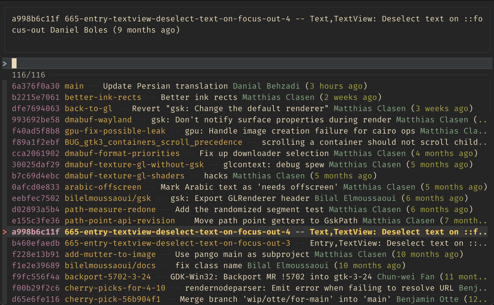

# git-switch-fzf

Simple bash wrapper around [git](https://github.com/git/git) and [fzf](https://github.com/junegunn/fzf) 
for interactively search branches( & tags ) and switching (and more) to them.


<details>
  <summary>Usage video</summary>
  <video width="640" src="https://github.com/emgyrz/git-switch-fzf/assets/12197614/647f8f8e-926d-49e9-ad3e-0c4a8f11d7b8"></video>  
</details>


## Install

Make sure that `fzf` is installed.
```shell
# on deb-based linux for example
sudo apt-get install fzf

# on mac
brew install fzf
```

Then copy git-switch-fzf script to some dir that is in your `$PATH` variable. See [this](https://stackoverflow.com/a/20054809)

___

Or you can run `install.sh` from this repo.

```shell
  git clone --depth=1 https://github.com/emgyrz/git-switch-fzf ./git-switch-fzf-tmp && \
  (./git-switch-fzf-tmp/install.sh || true) && \
  rm -rf ./git-switch-fzf-tmp
```
___

#### (Optional) Add short alias
```shell
# default behavior
echo 'alias gco="git-switch-fzf"' >> ~/.zshrc

# search in remotes
echo 'alias gcor="git-switch-fzf --type remote"' >> ~/.zshrc 

# update current environment
. ~/.zshrc

gco 
# ...it works
```


## Usage

Copy from `git-switch-fzf --help`

Usage: git-switch-fzf [options]

### Options

#### -t, --type TYPE     
Specify `TYPE` of git references where to search. 

Can be 'local', 'remote', 'tags' separated with ',' comma. 

Default is 'local'. 

Short names are 'l', 'r' and 't'
  
#### -r, --remote
Same as '--type remote'
  
#### -e, --exec CMD
Command to which the selected value will be passed. 

Default is 'git switch'
  
#### --take-hash
Return short commit hash instead of branch or tag name
   
#### --no-preview
Hide top preview
  
#### -h, --help
Print help message
  
### Examples

Basic usage without args
```sh
git-switch-fzf
```

Search in all references
```sh
git-switch-fzf --type local,remote,tags
# same as 
git-switch-fzf -t r,t,l
```
  
Search only in tags
```sh
git-switch-fzf -type t
```

Use 'checkout' instead of 'switch' 
```sh
git-switch-fzf -e "git checkout"
```

Just print to console selected item name
```sh
git-switch-fzf -e echo
```

Print to console hash of selected item
```sh
git-switch-fzf -e echo --take-hash
```

Use returned value in other command, e.g. for write it to file
```sh
echo "selected hash is \$(git-switch-fzf -e echo --take-hash)" > /tmp/test
```
  
___
Tested and works fine on Linux and macOS. Windows - not tested

